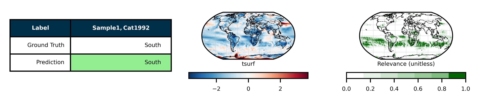

# Climate State Classifier

The demo gives an example for training and evaluating a model for climate state classification. In this specific example, a model is trained for identifying and locating a previous volcanic eruption based on a global sea surface temperature grid.

`climatestateclassifier` must be installed first (see [README](https://github.com/FREVA-CLINT/climatestateclassifier/tree/clint#readme))

## Structure

The `demo` folder contains:
- a text file `demo_train.txt` containing the input arguments of the train example
- a text file `demo_evaluate.txt` containing the input arguments of the evaluate example, loading a model which has been trained for 10000 iterations (tsurf.pth)
- a text file `demo_evaluate.txt` containing the input arguments of two 20CR examples, the 1809 unidentified eruption (18101tasnh.nc) and the 1815 Tambora eruption (18161tastr.nc), loading a model which has been trained for 10000 iterations (tsurf.pth)
- a directory `results` where the result files will be stored
- a directory `data` where the data is stored
- a directory `snapshots` where a demo model snapshot is stored

## Usage

The paths for the directories defined in `demo_train.txt` and `demo_evaluate.txt` are relative to the source root directory. Hence, the software should be run in the parent directory.

### CLI

```bash
climclass-train --load-from-file demo/demo_train.txt

climclass-evaluate --load-from-file demo/demo_evaluate.txt
```

### Python module

```python
from climatestateclassifier import train
train("demo/demo_train.txt")

from climatestateclassifier import evaluate
evaluate("demo/demo_evaluate.txt")
```

## Outputs

### The files

Each evaluation produces 2 sub-directories in the results directory:
- `explanations` contains heatmaps of the input files based on LRP
- `tables` contains different overview tables of the results


### Visualization

We can compare the heatmaps of different classes from the predictions of our pre-trained model (tsurf.pth):



